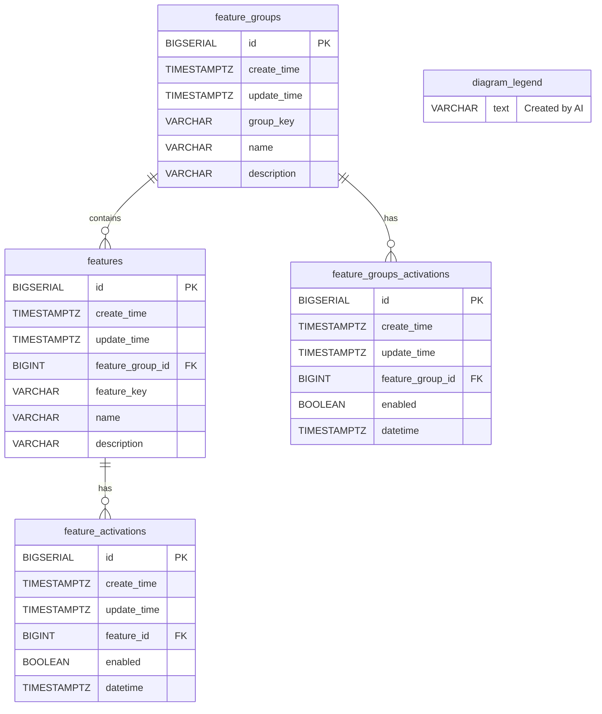

# Data Model

Internal data model of `tes-feature` is as follows:

```mermaid
erDiagram
    feature_groups {
        BIGSERIAL id PK
        TIMESTAMPTZ create_time
        TIMESTAMPTZ update_time
        VARCHAR group_key
        VARCHAR name
        VARCHAR description
    }

    features {
        BIGSERIAL id PK
        TIMESTAMPTZ create_time
        TIMESTAMPTZ update_time
        BIGINT feature_group_id FK
        VARCHAR feature_key
        VARCHAR name
        VARCHAR description
    }

    feature_groups_activations {
        BIGSERIAL id PK
        TIMESTAMPTZ create_time
        TIMESTAMPTZ update_time
        BIGINT feature_group_id FK
        BOOLEAN enabled
        TIMESTAMPTZ datetime
    }

    feature_activations {
        BIGSERIAL id PK
        TIMESTAMPTZ create_time
        TIMESTAMPTZ update_time
        BIGINT feature_id FK
        BOOLEAN enabled
        TIMESTAMPTZ datetime
    }

    diagram_legend {
        VARCHAR text "Created by AI"
    }

    feature_groups ||--o{ features: contains
    feature_groups ||--o{ feature_groups_activations: has
    features ||--o{ feature_activations: has
```
